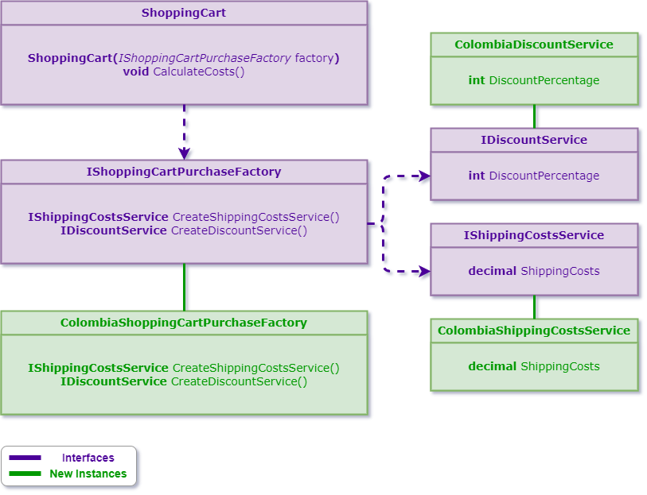

# Abstract Factory
### Definition
The intent of the abstract factory pattern is to provide an interface for creating
families of related or dependent objects without specifying their concrete classes.
### Common Usage Examples
- In this particular case, we will be using the following model:

### Tips
- Use an abstract class when you need to provide some basic functionality that can
be potentially overridden.
- Use an interface when you only need to specify the expected functionality of a
class.
- AbstractProduct declares an interface for a type of product object.
### Pattern Consequences
- The client is decoupled from the concrete factory implementation.
### Related Patterns