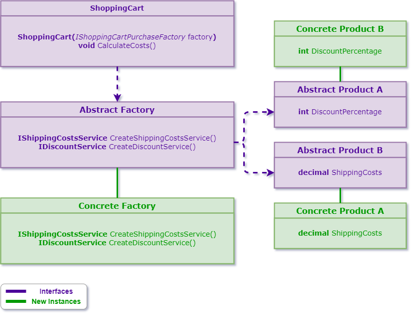

# Abstract Factory
### Definition
The intent of the abstract factory pattern is to provide an interface for creating
families of related or dependent objects without specifying their concrete classes.
### Common Usage Examples
- When you want to support multiple languages for a product.
- When you need to support documents to different formats.
- When abstracting away your database access layer.
- When supporting different application themes or styles.
- In this particular case, we will be using the following model:

- When a system should be independent of how its products are created, composed and
represented.
- When you want to provide a class library of products and you only want to reveal their
interfaces, not their implementations.
- When a system should be configured with one of multiple families of products.
- When a family of related product objects is designed to be used together and you
want to enforce this constraint.

### Tips
- Use an abstract class when you need to provide some basic functionality that can
be potentially overridden.
- Use an interface when you only need to specify the expected functionality of a
class.
- An **Abstract Product** declares an interface for a type of product object.
- A **Concrete Product** defines the product that has to be created by a corresponding
factory, and implements the AbstractProduct interface.
- An **Abstract Factory** declares an interface for operations that create *Abstract Product*
objects.
- A **Concrete Factory** implements the operations to create *Concrete Product* objects.
- Updated model with *Concrete* and *Abstract* representations:
  
- The client uses only interfaces declared by *Abstract Factory* and *Abstract Product*.
### Pattern Consequences
- The client is decoupled from the concrete factory implementation.
- It isolates concrete classes, because it encapsulates the responsibility and the process
of creating product objects.
- New products can easily be introduced without breaking client code: *Open/Closed principle*.
- Code to create products is contained in one place: *Single Responsibility Principle*.
- It makes exchanging product families easy.
- It promotes consistency among products.
- Supporting new kinds of products is rather difficult.
### Related Patterns
- **Factory Method:** Abstract factory can be implemented using factory methods.
- **Prototype:** Abstract factory can be implemented using prototypes.
- **Singleton:** A concrete factory is often implemented as a singleton.