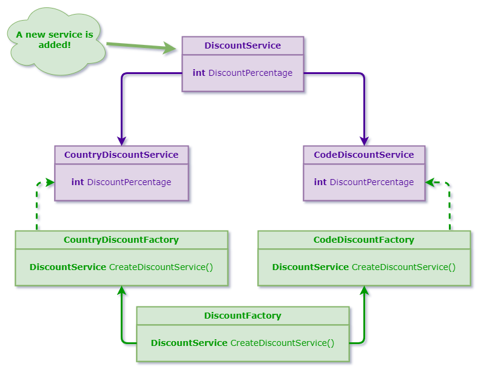

# Factory Method
### Definition
The intent of the factory method patterns is to define an interface for creating
and object, but to let subclasses decide which class to instantiate. Factory
method lets a class defer instantiation to subclasses.
### Common Usage Examples
- For this project I will use a discount service scenario:

### Tips
### Pattern Consequences
### Related Patterns